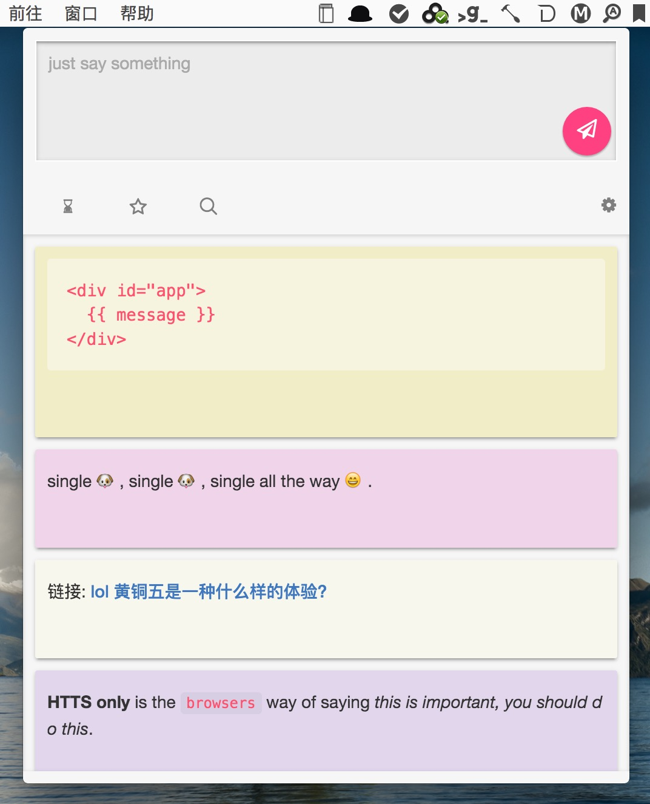
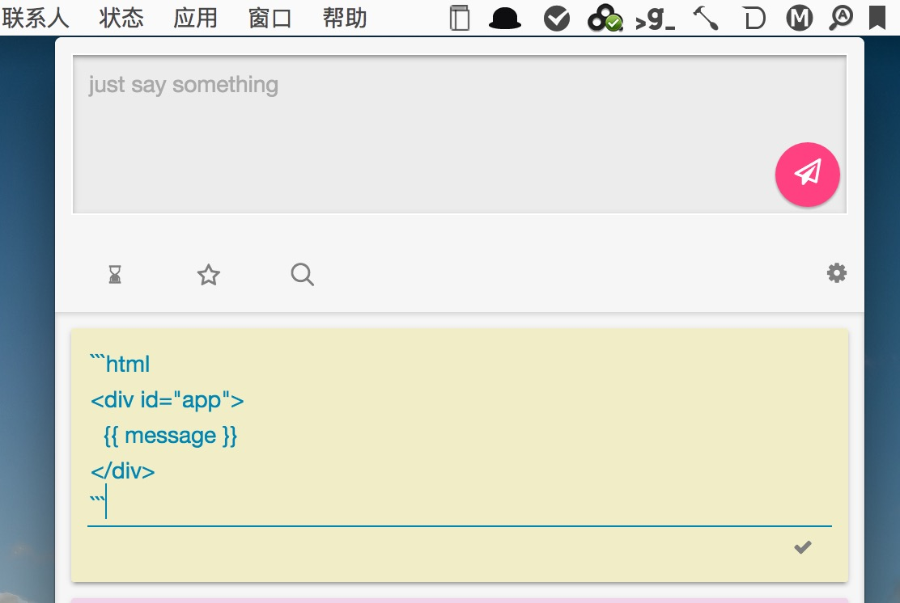

# Fewords
> a simple notepad supports markdown

fewords是few words两个词拼成的名字，是个功能极其简单的纯文本笔记本，用于随手记录几句话，一条短语之类的，写这个应用的原本目的是用于学英语的时候记录下英文的句子。

这是个本地笔记本，没有远程服务器，不过可以把存储目
录设置到云盘，也可以同步。

## Download
- for mac: [fewords.dmg](http://pan.baidu.com/s/1o68bvPS)

## Features
- 支持markdown
- 支持emoji
- 排序，星标，搜索

## Screenshot

- 列表:
    

- 编辑:
    

## Todo
- 翻页
- 日历选择
- 日期分隔符
- 代码语法高亮
- for windows

## Development
- 安装fis3 :  `npm install -g fis3`
- 安装fis的插件: `npm install -g fis3-hook-relative` 和 `npm install fis-parser-sass -g`
- 进入项目根目录: `npm install`
- fis编译: `fis3 release -wd ../fewords-build`
- 拷贝node_modules目录到fewords-build目录 `cp -ap node_modules ../fewords-build/`
- fis编译后预览: `cd ../fewords-build` 后执行 `electron ./`
- 编译app: `cd ../fewords-build` 后执行 `npm run build`
- 打包dmg: `cd ../fewords-build` 后执行 `npm run pack`

## Thanks
- [vue](http://vuejs.org/)
- [electron](http://electron.atom.io/)

## License
- MIT
